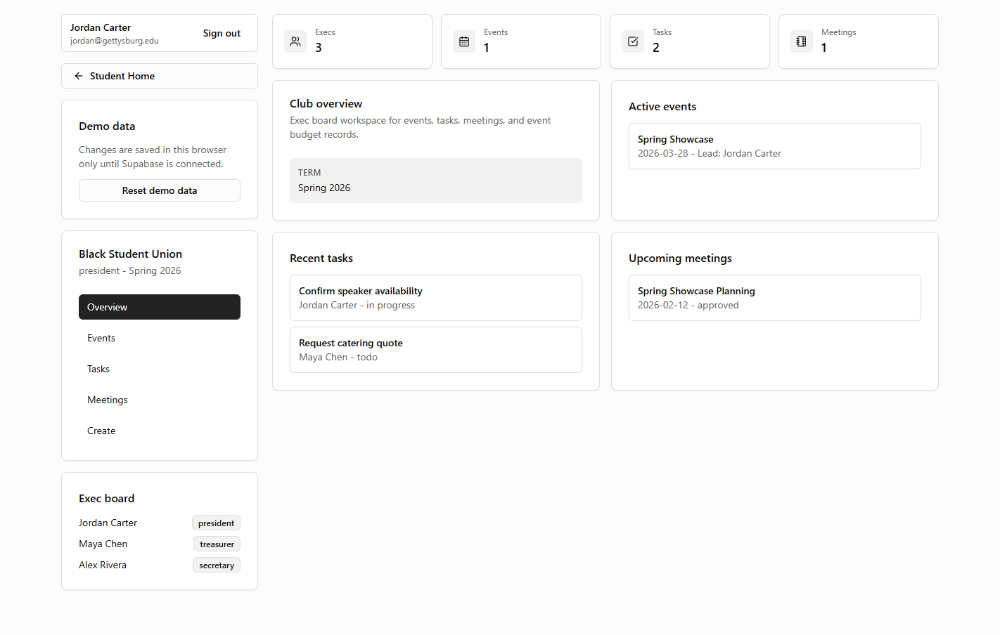
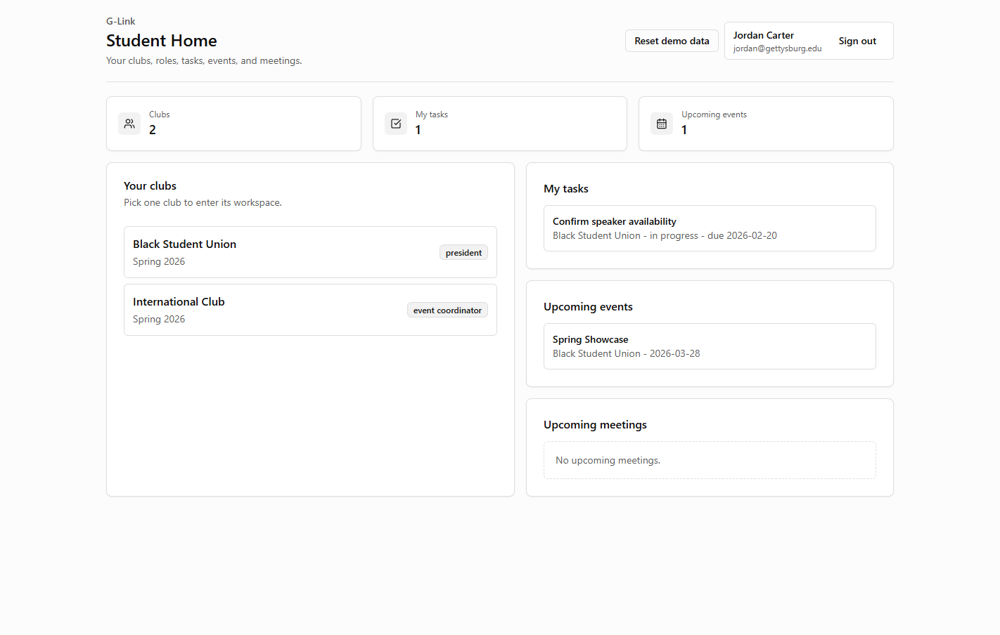
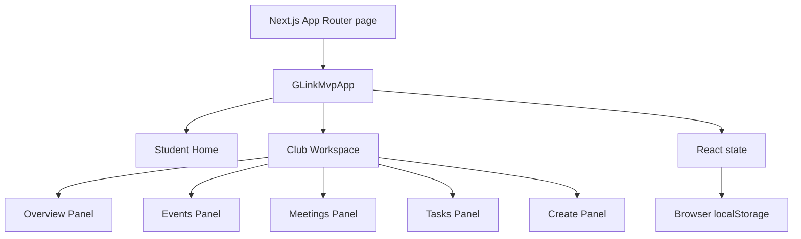

# G-Link

**A connected operations workspace for student club executive boards.**

G-Link brings club events, meetings, tasks, roles, and simple event budgets into one workflow. The prototype focuses on a common student-organization problem: decisions happen in meetings, follow-up work gets scattered across chats and documents, and the next executive board inherits very little useful context.

> **Current status:** functional frontend MVP. Data is stored in browser `localStorage`; real authentication and database persistence are planned next.



<details>
<summary>Student Home</summary>



</details>

## Why I Built It

Student clubs often coordinate through a mixture of group chats, shared documents, spreadsheets, email, and memory. Each tool works independently, but the workflow between them is weak.

G-Link tests a more connected model:

```text
Student Home -> Club Workspace -> Event -> Meeting -> Assigned Task
```

A task can retain its club, event, source meeting, assignee, due date, and status. That connection is the core product idea.

## Working Features

- Demo sign-in and cross-club Student Home
- Club-specific workspaces with executive roles
- Club overview with active events, recent tasks, and upcoming meetings
- Event creation and editing
- Event lead, status, description, planned budget, and actual budget
- Meeting scheduling followed by in-meeting notes and conclusions
- Tasks linked to a club, event, meeting, assignee, and due date
- Personal task and full club task views
- Task editing, status changes, and removal
- Connected navigation between events, meetings, and tasks
- Responsive desktop/mobile layout
- Browser persistence and resettable demo data
- Basic role checks for record creation

## Product Walkthrough

1. Sign in with the prefilled demo profile.
2. Choose a club from Student Home.
3. Create an event, meeting, or task from the club workspace.
4. Link a meeting to an event.
5. Record notes and conclusions during the meeting.
6. Assign follow-up tasks to club members.
7. Track the same task from Student Home, the club task view, its event, or its source meeting.

## Architecture



`GLinkMvpApp` owns the prototype data and actions. Feature components receive data and callbacks through typed props. This keeps the product flow visible while leaving a clear replacement point for Supabase.

See [docs/architecture.md](docs/architecture.md) for the file-level map.

## Tech Stack

- Next.js 16 App Router
- React 19
- TypeScript
- Tailwind CSS 4
- shadcn/ui primitives and Radix UI
- Lucide icons
- `localStorage` prototype persistence
- Supabase client prepared for the next backend phase

## Engineering Decisions

- **Manual workflow first:** meeting notes and task creation work without relying on AI.
- **Events as the operational center:** meetings, tasks, and budget totals connect back to an event.
- **Explicit edit modes:** records are read-only until the user chooses to edit, reducing accidental changes.
- **Simple budgets first:** planned and actual totals validate the workflow without prematurely building accounting software.
- **Feature-based component split:** UI panels are separated by product responsibility instead of remaining in one large component.
- **Honest prototype boundary:** browser storage supports product testing; it is not presented as production persistence.

More detail: [docs/case-study.md](docs/case-study.md) and [docs/technical-decisions.md](docs/technical-decisions.md).

## Run Locally

Requirements:

- Node.js 20.9 or newer
- npm

```bash
git clone https://github.com/ashimaryal25-ops/G-Link.git
cd G-Link
npm install
npm run dev
```

Open [http://localhost:3000](http://localhost:3000).

The demo login is prefilled. No Supabase credentials are required for the current frontend prototype.

## Quality Checks

```bash
npm run lint
npx tsc --noEmit
npm run build
```

## Project Structure

```text
src/
|-- app/                         # Next.js route, layout, global styles
|-- components/
|   |-- g-link-mvp-app.tsx      # App state, actions, navigation
|   `-- ui/                     # Reusable UI primitives
|-- features/g-link/
|   |-- student-home.tsx
|   |-- club-workspace.tsx
|   |-- events-panel.tsx
|   |-- meetings-panel.tsx
|   |-- tasks-panel.tsx
|   |-- create-panel.tsx
|   |-- types.ts
|   |-- demo-data.ts
|   `-- helpers.ts
`-- lib/                        # Shared utilities and Supabase client
```

## Next Milestones

1. Replace demo login with Supabase Auth.
2. Move clubs, memberships, events, meetings, and tasks to PostgreSQL.
3. Add row-level security and server-validated role permissions.
4. Pilot the workflow with one or two student executive boards.
5. Add archive/handoff features after the core workflow is validated.

Longer-term ideas such as calendar links, email integration, and cross-club collaboration are recorded separately in [docs/future-ideas.txt](docs/future-ideas.txt).

## Documentation

- [Product brief](docs/product-brief.md)
- [Technical case study](docs/case-study.md)
- [Architecture map](docs/architecture.md)
- [MVP plan](docs/mvp-plan.md)
- [Data model](docs/data-model.md)
- [Engineering log](docs/engineering-log.md)

## Author

Built by [Ashim Aryal](https://github.com/ashimaryal25-ops), a Computer Science and Mathematical Economics student exploring product engineering, applied AI, and tools for student organizations.
